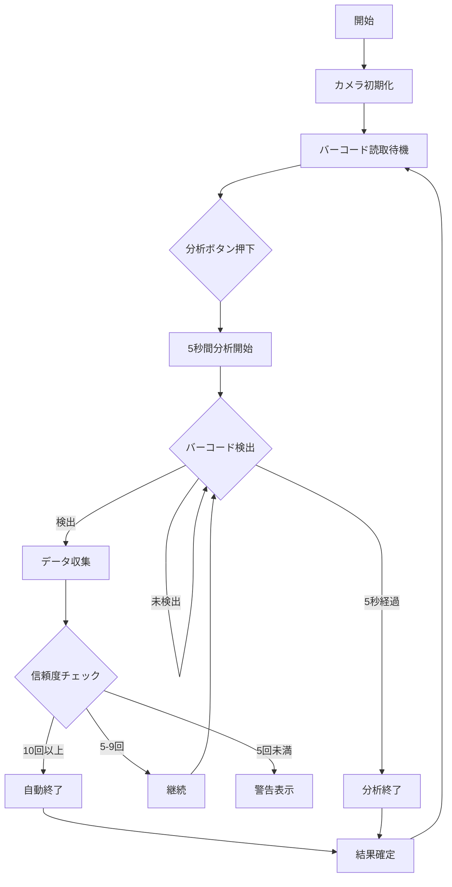

https://script.google.com/macros/s/AKfycbxcjXabZ3UNQHnyYQTGhsPfKEckX7j4ZVNK9z29xO0/dev

# バーコードスキャナーアプリケーション

## 概要
スマートフォンのカメラを使用してEAN-13バーコードを読み取り、高精度な結果を得るためのWebアプリケーション。

## 主な機能

### 1. バーコード読み取り
- EAN-13形式のバーコードに対応
- チェックデジット検証による精度向上
- リアルタイムカメラプレビュー表示

### 2. 5秒間分析機能
- ボタン押下から5秒間のデータ収集
- リアルタイムでの読み取り状況表示
- 自動終了機能（10回以上の同一コード検出時）

### 3. 信頼度判定
- 最小信頼度：5回以上の検出
- 最適信頼度：10回以上の検出
- 信頼度低下時の警告表示

### 4. リアルタイム分析
- 読み取り回数のカウント
- 頻度分析とパーセンテージ表示
- プログレスバーによる視覚的表示

## 動作フロー

## 技術仕様

### 使用ライブラリ
- QuaggaJS v0.12.1：バーコード読み取り

### 信頼度判定基準
- 最小信頼度（警告表示）: 5回未満
- 通常信頼度: 5-9回
- 高信頼度（自動終了）: 10回以上

### UI/UX
- スマートフォン最適化レイアウト
- リアルタイムフィードバック
- プログレスバーによる視覚的表示
- スキャン状態のアニメーション表示

## 使用方法
1. アプリケーションを開く
2. カメラをバーコードに向ける
3. 「5秒間の分析を開始」ボタンを押す
4. バーコードを読み取る
   - 10回以上の同一コード検出で自動終了
   - または5秒経過で終了
5. 結果を確認
   - 信頼度が低い場合は再度読み取り
   - 十分な信頼度の場合は結果確定

## エラー処理
- チェックデジット検証による不正コードの排除
- 信頼度低下時の警告表示
- カメラ初期化エラーの検出と表示
