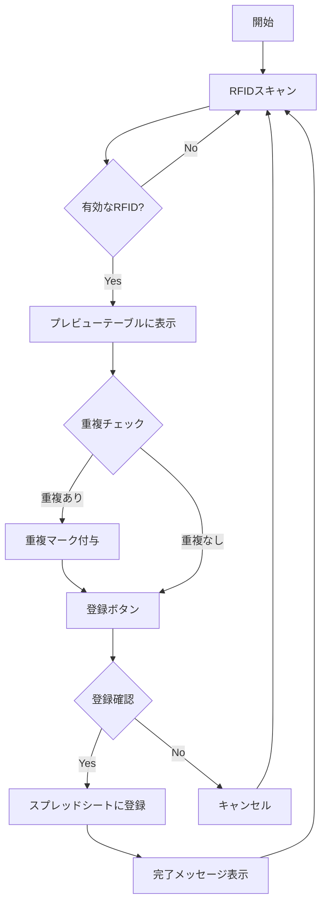
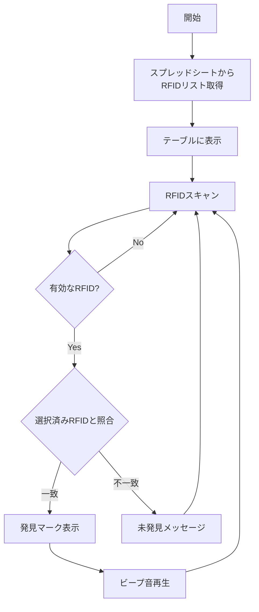
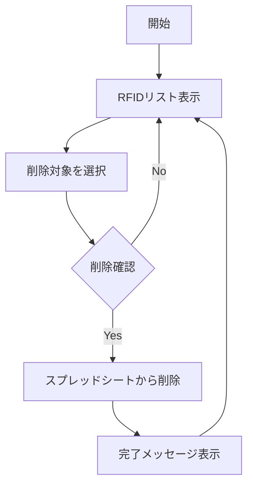
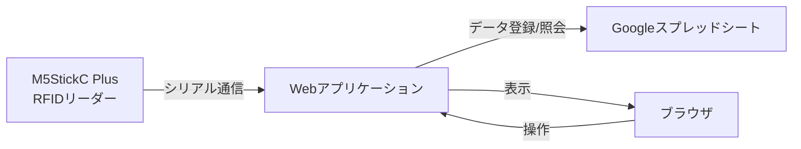

# RFID管理システム フローチャート

# 主機能
1. JANコードとRFIDを読み取り、スプレッドシートに登録する機能
2. スプレッドシートかRFIDやJANコードを読み取り表にする機能
3. JANコードを指定し、対応するRFIDをRFIDリーダで探索できる機能

スプレッドシートのフィールドと一例
登録時間	RFID ID(EPC)	メーカー	カテゴリ	名称	JANコード
2024-11-06T08:09:53.774Z	E2806F12000000021FC2FF63	ユニクロ	ニット・セーター	ニット・セーター１	

## ファイル
rfidapp.html
Code.gs

## 現状の実装内容
### 実装済み機能
- RFID読み取り機能（24文字固定長）
- スプレッドシートへのRFID登録
- 重複RFID検出と視覚的表示
- RFIDリストの表示と検索
- 選択したRFIDの削除機能
- アクティブモード（常時入力フォーカス維持）
- レスポンシブデザイン対応
- 発見時の音声フィードバック

### 実装済みUI/UX
- モバイル対応レイアウト
- 登録/照会モード切り替え
- プレビュー表示機能
- 成功/エラーメッセージ表示
- スプレッドシート直接参照ボタン
- 大きめのチェックボックスでの選択UI
- 発見状態の視覚的表示（✓マークと回数）

### データ管理
- Googleスプレッドシートとの連携
- RFIDデータの永続化
- タイムスタンプ記録
- 重複エントリの管理

## 1. RFID登録機能

## 2. RFID照会機能

## 3. RFID削除機能

## システム構成

Sheet
https://docs.google.com/spreadsheets/d/1DpijamOOnYjeZB7M8hEKt2DzRaiL5Xr0lKqTeKPxwjs/edit?gid=0#gid=0

Script
https://script.google.com/home/projects/11oV1ObMjEXsnHkKIdF5QpaBFVMqPdVmRZgnHtgeW-N1DrZhDKpbLiGge/edit