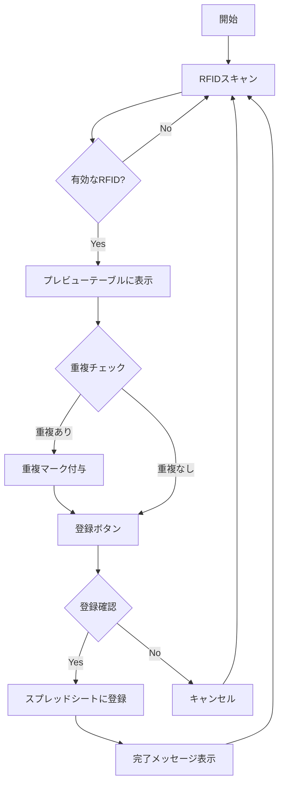
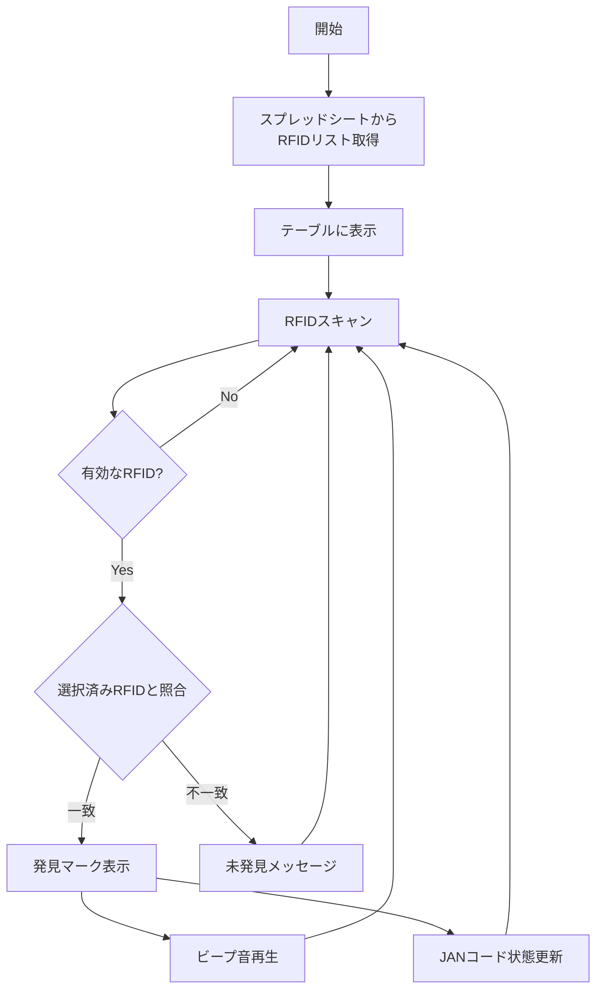
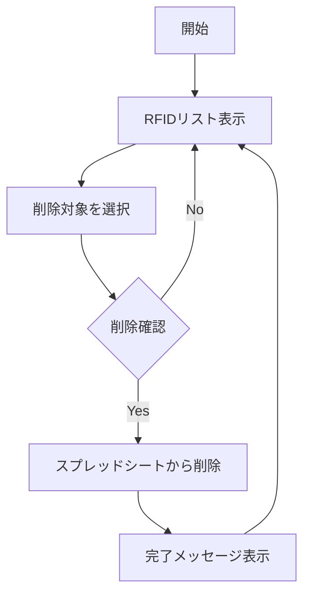
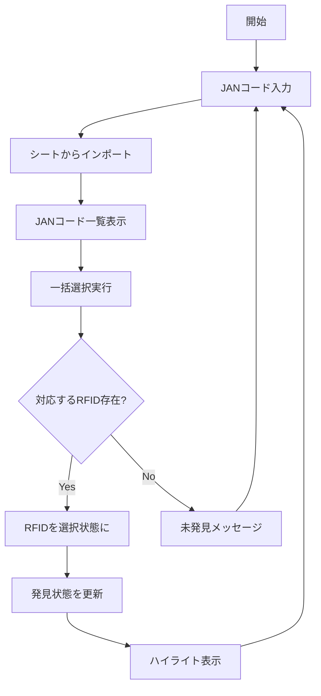
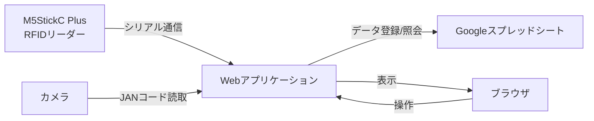

# RFID管理システム フローチャート

# 主機能
1. 登録モードにおいて、JANコードとRFIDを読み取り、スプレッドシート"JAN-RFID"に登録する
2. 照会モードにおいて、"JAN-RFID"シートを読み込み、また選択した探索票を読み込み、JANコードに紐づくRFIDを探索する
3. JRFIDが入力された際に指定されたJANコードに対応するRFIDを探索し、発見されると音で発見を通知する

#変更点
・登録モードでは初めに読み取ったRFIDのみ登録できるようにし、1レコードのみ登録可能にする
・照会モード選択時
　・初めに"JAN-RFID"シートを読み込む。(これは照会モード選択時のみ読み込む)
　・"シートからJANコードインポート"し、探索するJANコードを読み込み、表にする。
　　表のフィールドは、下記とする。
　　　選択　JANコード　該当RFID　探索状態
　　・選択は、チェックボックスを設け、チェックを付けたJANコードを探索対象とする。
　　・RFIDが入力された際、"JAN-RFID"シートから、読み込んだJANコードリストに対応するRFIDを探索する

・選択したJANコードに対応するRFIDが存在する場合、該当RFID欄に"発見"と表示する。
　　・探索状態にはチェックボックスを設け、人が実際に見つけた場合に、人がチェックを付ける。チェックを付けた場合、選択フィールドのチェックを外し、探索対象から外す。

JANコード表のフィールド(シート名：探索票)
No 商品情報	JANcode	Vendor	Category	Name

JAN-RFID表のフィールド(シート名：JAN-RFID)
JAN RFID

## ファイル
rfidapp.html
Code.gs

## 現状の実装内容
### 実装済み機能
- RFID読み取り機能（24文字固定長）
- スプレッドシートへのRFID登録
- 重複RFID検出と視覚的表示
- RFIDリストの表示と検索
- 選択したRFIDの削除機能
- アクティブモード（常時入力フォーカス維持）
- レスポンシブデザイン対応
- 発見時の音声フィードバック
- JANコードの一括インポート機能
- カメラでのJANコード読み取り機能
- 複数JANコードの同時探索機能
- 発見状態の永続的な保持機能

### 実装済みUI/UX
- モバイル対応レイアウト
- 登録/照会モード切り替え
- プレビュー表示機能
- 成功/エラーメッセージ表示
- スプレッドシート直接参照ボタン
- 大きめのチェックボックスでの選択UI
- 発見状態の視覚的表示（✓マークと回数）
- JANコード入力行の動的追加
- シート選択モーダル
- カメラビューワー
- 発見状態の永続表示

### データ管理
- Googleスプレッドシートとの連携
- RFIDデータの永続化
- タイムスタンプ記録
- 重複エントリの管理
- JANコードの発見状態の永続化
- シート間のデータインポート

## 1. RFID登録機能

## 2. RFID照会・探索機能

## 3. RFID削除機能

## 4. JANコード一括探索機能

## システム構成

## 関連リンク
Sheet: https://docs.google.com/spreadsheets/d/1DpijamOOnYjeZB7M8hEKt2DzRaiL5Xr0lKqTeKPxwjs/edit?gid=0#gid=0

Script: https://script.google.com/home/projects/11oV1ObMjEXsnHkKIdF5QpaBFVMqPdVmRZgnHtgeW-N1DrZhDKpbLiGge/edit